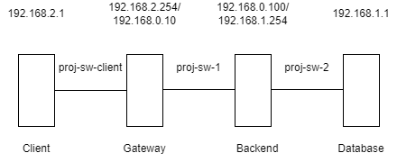
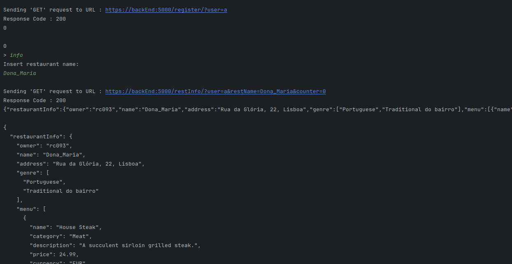
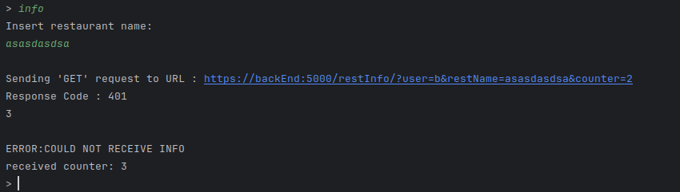
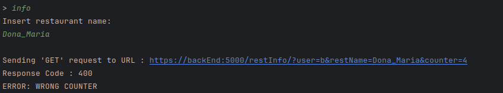
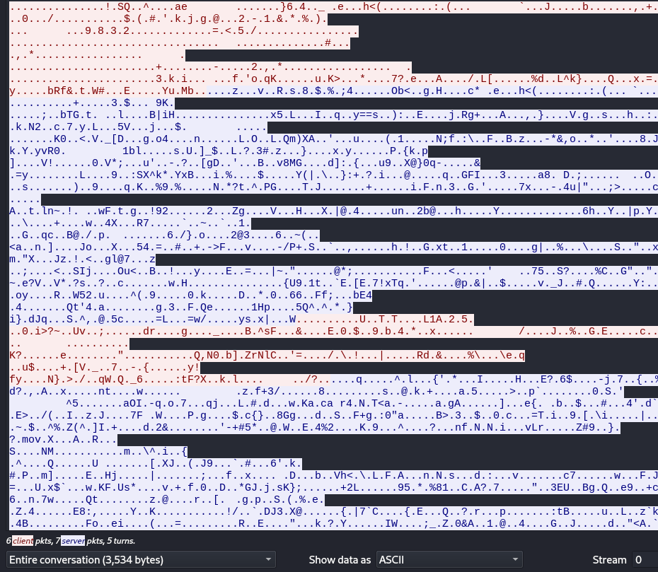
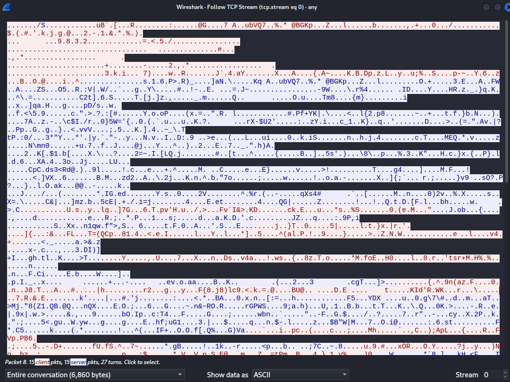

# A55 BombAppetit Project Read Me

## Team

| Number | Name              | User                                     | E-mail                                          |
| -------|-------------------|------------------------------------------|-------------------------------------------------|
| 99183  | Beatriz Militão   | <https://github.com/BeatrizPDAMilitao>   | <mailto:beatriz.militao@tecnico.ulisboa.pt>     |
| 99305  | Pedro Neves       | <https://github.com/PedroMSNeves>        | <mailto:pedro.santos.neves@tecnico.ulisboa.pt>  |
| 99306  | Pedro Mateus      | <https://github.com/PedRicM>             | <mailto:pedro.r.mateus@tecnico.ulisboa.pt>      |

  

## Contents

This repository contains documentation and source code for the *Network and Computer Security (SIRS)* project.

The [REPORT](REPORT.md) document provides a detailed overview of the key technical decisions and various components of the implemented project.
It offers insights into the rationale behind these choices, the project's architecture, and the impact of these decisions on the overall functionality and performance of the system.

This document presents installation and demonstration instructions.

## Installation

To see the project in action, it is necessary to setup a virtual environment, with 3 networks and 4 machines.  

The following diagram shows the networks and machines:



### Prerequisites

All the virtual machines are based on: Linux 64-bit, Kali 2023.3

Download [Kali](https://cdimage.kali.org/kali-2023.4/kali-linux-2023.4-virtualbox-amd64.7z)
Unzip and create a new vm with that disk (.vdi)
(possibly you can increase the virtual memory, ram and processors numbers for the vm)

When you open kali:

    Username: kali
    Password: kali

Inside the kali download [intelij](https://www.jetbrains.com/idea/download/download-thanks.html?platform=linux&code=IIC)

To change the kali to a portuguese keyboard do:
 - find in the search bar the keyboard
 - go to layout
 - uncheck the use system defaults
 - click on add (and choose portuguese)
 - and remove english

Copy the [script](script.sh) to a new file in the home directory and run it.
```sh
$ sh script.sh
```

You can do "java --version" to check if you have java 17

Open intellij and download the repository (You can open intellij by doing ./idea.sh in the home directory)):

    https://github.com/tecnico-sec/a55-pedro-beatriz-pedro.git
Go to project structure and
select sdk:
- click in download jdk version 17 (amazon corretto 17.0.9)
- and click on apply

Open a terminal and do:
```sh
$ mvn clean compile install
```
on the root of the project

#### Clone Machines
close kali and right click on the virtualbox kali icon
- choose clone
  - choose name (first will be the gateway), click next
  - linked clone, click finish
  - in the virtualbox go to the settings of gateway
  - click in network
  - change adapter1 to:
    - internal network with name proj-sw-1
  - change adapter2 to:
    - internal network with name proj-sw-client

- choose clone
  - choose name (second will be the backend), click next
  - linked clone, click finish
  - in the virtualbox go to the settings of backend
  - click in network
  - change adapter1 to:
    - internal network with name proj-sw-1
  - change adapter2 to:
    - internal network with name proj-sw-2

- choose clone
  - choose name (third will be the database), click next
  - linked clone, click finish
  - in the virtualbox go to the settings of database
  - click in network
  - change adapter1 to:
    - internal network with name proj-sw-2

- choose clone
  - choose name (fourth will be the client), click next
    - linked clone, click finish
    - in the virtualbox go to the settings of client
    - click in network
    - change adapter1 to:
      - internal network with name proj-sw-client

### Machine configurations
Next we have custom instructions for each machine.

#### Machine 1 - Gateway

This machine runs the Gateway.

Power up the VM and edit /etc/network/interfaces with root privileges.
```sh
$ sudo nano /etc/network/interfaces
```
And change the content to:

    # This file describes the network interfaces available on your system
    # and how to activate them. For more information, see interfaces(5).
    
    source /etc/network/interfaces.d/*
    
    # The loopback network interface
    auto lo eth0 eth1
    iface lo inet loopback
    
    # proj-sw-1 interface
    iface eth0 inet static
        address 192.168.0.10
        netmask 255.255.255.0
    
    # proj-sw-client interface
    iface eth1 inet static
        address 192.168.2.254
        netmask 255.255.255.0
For the change to be effective you need to restart the machine.

To verify:

```sh
$ ifconfig
```
To configure the firewall run the iptables script that is in the directory iptablesScripts of the project:
```sh
$ sudo sh iptablesGateway.sh
```
To verify:
```sh
$ sudo iptables -L
```

#### Machine 2 - Backend

This machine runs the Backend.

Power up the VM and edit /etc/network/interfaces with root privileges.
```sh
$ sudo nano /etc/network/interfaces
```
And change the content to:

    # This file describes the network interfaces available on your system
    # and how to activate them. For more information, see interfaces(5).
    
    source /etc/network/interfaces.d/*
    
    # The loopback network interface
    auto lo eth0 eth1
    iface lo inet loopback
    
    
    # proj-sw-1 interface
    iface eth0 inet static
        address 192.168.0.100
        netmask 255.255.255.0
        gateway 192.168.0.10
    
    # proj-sw-2 interface
    iface eth1 inet static
        address 192.168.1.254
        netmask 255.255.255.0

For the change to be effective you need to restart the machine.

To verify:

```sh
$ ifconfig
```
To configure the firewall run the iptables script that is in the directory iptablesScripts of the project:
```sh
$ sudo sh iptablesBackend.sh
```
Note: 127.0.0.1 is in the rules because intellij needs it.

To know were the Database is, go to:
```sh
$ sudo nano /etc/hosts
```
And add this line:

    192.168.1.1  dataBase
To verify:

```sh
$ sudo iptables -L
```

#### Machine 3 - Database

This machine runs the Database.

Power up the VM and edit /etc/network/interfaces with root privileges.
```sh
$ sudo nano /etc/network/interfaces
```
And change the content to:

    # This file describes the network interfaces available on your system
    # and how to activate them. For more information, see interfaces(5).
    
    source /etc/network/interfaces.d/*
    
    # The loopback network interface
    auto lo eth0
    iface lo inet loopback
    
    # proj-sw-2 interface
    iface eth0 inet static
        address 192.168.1.1
        netmask 255.255.255.0
For the change to be effective you need to restart the machine.

To verify:

```sh
$ ifconfig
```
To configure the firewall run the iptables script that is in the directory iptablesScripts of the project:
```sh
$ sudo sh iptablesDatabase.sh
```
To verify:
```sh
$ sudo iptables -L
```
Finally:

Do the [postgresql setup](DataBase/setup.md)

#### Machine 4 - Client

This machine runs the Client.

Power up the VM and edit /etc/network/interfaces with root privileges.
```sh
$ sudo nano /etc/network/interfaces
```
And change the content to:

    # This file describes the network interfaces available on your system
    # and how to activate them. For more information, see interfaces(5).
    
    source /etc/network/interfaces.d/*
    
    # The loopback network interface
    auto lo eth0
    iface lo inet loopback
    
    # proj-sw-client interface
    iface eth0 inet static
        address 192.168.2.1
        netmask 255.255.255.0
        gateway 192.168.2.254
For the change to be effective you need to restart the machine.

To verify:

```sh
$ ifconfig
```
To know were the backEnd is, go to:
```sh
$ sudo nano /etc/hosts
```
And add this line:

    192.168.0.100  backEnd

## Demonstration

Now that all the networks and machines are up and running, ...

### To run the project:

#### In the Database

```sh
$ cd DataBase
$ sh postgresql.sh
```

#### In the Backend
Run the __Server_BackEnd/src/main/java/org/example/Main.java__ .
Note: The server receives a file as argument.
The file contains the database domain name,
the database port, the username and password for the database,
the server private key, the server public key,
the client public key and finally the port for the https server.

You can use the file [args](Server_BackEnd/src/main/resources/args.txt) as argument.
#### In the Client
Run the __Client/src/main/java/org/example/Main.java__ .
Note: The client receives a file as argument.
The file contains the server domain name,
the server port,
the client private key, the client public key and
the server public key.

You can use the file [args](Client/src/main/resources/args.txt) as argument.

#### Now that everything is running, you can use the client to interact with the server.

NOTE: The names of the clients, restaurant and the review description cannot have spaces, because of the URLs.

This is an example of a successful interaction:


If some of the arguments provided are incorrect, the response code will be 401.


If the counter is wrong the response code will be 400.



This is a wireshark capture of the interaction between the client and the server:


This is a wireshark capture of the interaction between the server and the database:


As we can see the communications are encrypted.

This concludes the demonstration.

## Additional Information

### Links to Used Tools and Libraries

- [Java 17](https://www.oracle.com/java/technologies/javase/jdk17-archive-downloads.html)
- [Maven 3.8.7](https://maven.apache.org/)

----
END OF README
