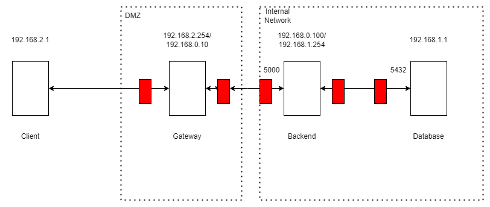
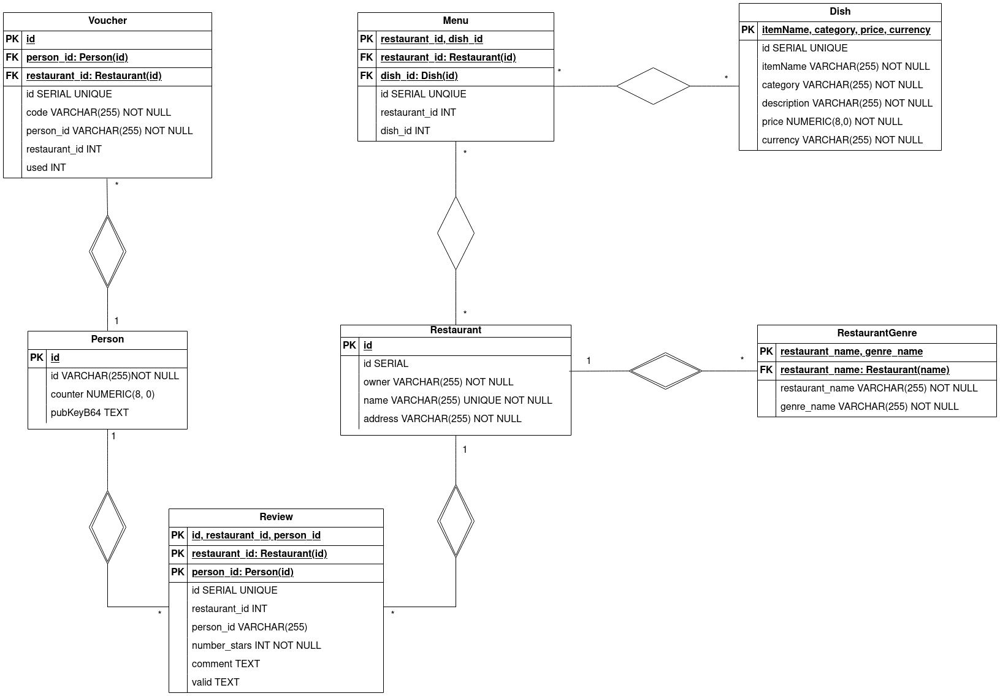

# A55 BombAppetit Project Report

## 1. Introduction

BombAppetit is a web application tailored to enhance the dining experience. It simplifies restaurant reservations with an intuitive interface. Users can explore a curated list of local restaurants based on their location, making it easy to find the perfect dining spot. BombAppetit facilitates table reservations for any group size.
The system integrates with a discount card service, allowing patrons to redeem their accumulated points for attractive booking discounts. BombAppetit revolutionizes dining convenience, connecting users with delightful culinary experiences.

Clients can ask for the restaurant information, send vouchers to other clients, use vouchers, make and delete reviews.
### 1.1. Secure Documents

The document that needs to be secured is the restaurant information.
The restaurant information contains the information about the restaurant, the menu, the vouchers and the reviews.

### 1.2. Infrastructure

Client-Firewall-gateway-firewall-backend-firewall-database

### 1.3. Security Challenge
Introduce reviews with classification made by users, e.g. 1 to 5 stars and some text. Reviews should be non-repudiable and other users must be able to verify the authenticity of each review, to ensure credibility and trustworthiness in user feedback.
Regarding the vouchers, each one is tied to a specific user and can only be used once. Moreover, a new mechanism must be implemented to allow users to directly transfer vouchers to other users of the service.
Each user still only has its own keys, so, some dynamic key distribution will have to be devised.

### 1.4. Database diagram

For a better understanding of the database, we present a diagram of the database.

## 2. Project Development

### 2.1. Secure Document Format

#### 2.1.1. Design

##### 2.1.1.1 Menu
As the restaurant information itself (name, owner, ..., menu ) does not need to be confidential there is no need to encrypt it.

##### 2.1.1.1 Voucher
The vouchers need to be confidential, so to do that we encrypt them using a symmetric key (session key). This session key also needs to be passed to the client, encrypted using the client public key.

To ensure authenticity we create and send a Digital Signature.

    RestaurantInfo + E( voucher, Ksym ) + E( Ksym, Kcu ) + E( H( All Info ), Ksr )

#### 2.1.2. Implementation

This project is implemented using java.

The parts of the message that ensure authenticity are passed inside the json object in a new property called __auth__.

##### 2.1.2.1 Protect the restaurant information
We added a nonce inside the property __auth__ in a new property called __counter__, to ensure freshness.

The DS is calculated with the Signature method present in the __java.security__ package, using RSA to encrypt and SHA256 to calculate the hash.
The DS is then added in the property __auth__ in a new property called __DS__.

Then we retrieve the __vouchers__ property and remove it.

To encrypt the voucher we need to generate a symmetric key and a initialization vector. We use the AES algorithm to generate the key with size 128, and Secure Random to generate a random IV (16 bytes).

The symmetric key and the IV are encrypted with the client public key, and using RSA with mode ECB. Since the symmetric key and the IV will always be different ECB is enough.
The vouchers are encrypted using the CBC mode to ensure even more confidentiality.
Every encrypted message is then encoded in Base64.

The encrypted vouchers are then added to the __vouchers__ property and the encrypted IV and encrypted symmetric key are added in the __auth__ property in the properties __encIV__ and __encSymKey__ respectively.

In practice:
    
    {
        "restaurantInfo": {
            "owner": "Maria Silva",
            "restaurant": "Dona Maria",
            "address": "Rua da Glória, 22, Lisboa",
            "genre": ["Portuguese", "Traditional"],
            "menu": [
            {
                "itemName": "House Steak",
                "category": "Meat",
                "description": "A succulent sirloin grilled steak.",
                "price": 24.99,
                "currency": "EUR"
            }
            ],
            "auth": {
                "DS": digital Signature,
                "counter": nonce,
                "encIV": encrypted IV,
                "encSymKey": encrypted symmetric key
            },
            "vouchers": encrypted vouchers
        }
    }

##### 2.1.2.1 Unprotect the restaurant information

When receiving the menu we only need to check its integrity. This is done by extracting the DS from the json and then verifying that the signature is correct.

 - The first step is to parse the message to a json object
 - The second step is to extract the IV, the symmetric key and the digital signature from the json object
 - After retrieving the IV and the symmetric key we can decript the vouchers
 - Next we add the decoded vouchers to the json
 - And lastly we verify that the signature is correct and that the nonce is also correct

### 2.2. Infrastructure

#### 2.2.1. Network and Machine Setup

__GATEWAY:__

The gateway is in a DMZ zone. Redirects the traffic from the client to the backend and vice-versa.
The gateway only redirects traffic from the backend to the client if it is a response to a request from the client,
and only redirects traffic to the backend on port 5000.
Rejects all other traffic.

| Rule | type    | SourceIP      | SourcePort | TranspProtocol  | DestIP        | DestPort | State   | Action |
|------|---------|---------------|------------|-----------------|---------------|----------|---------|--------|
| 1    | FORWARD | 192.168.0.100 | 5000       | TCP             | *             | *        | Establ. | Accept |
| 2    | FORWARD | *             | *          | TCP             | 192.168.0.100 | 5000     | New     | Accept |
| 3    | *       | *             | *          | *               | *             | *        | *       | Reject |

__BACKEND:__

The backend is in the internal network.
Accepts traffic from the DB from port 5432 and tcp traffic to port 5000.
The traffic from the DB is only accepted if the connection is not new.
The backend sends traffic to the DB to port 5432, and only sends traffic to other ips if the connection is already established.
Rejects all other traffic.

| Rule | type      | SourceIP      | SourcePort | TranspProto | DestIP        | DestPort | State   | Action |
|------|-----------|---------------|------------|-------------|---------------|----------|---------|--------|
| 1    | INPUT     | 127.0.0.1     | *          | *           | 127.0.0.1     | *        | New     | Accept |
| 2    | INPUT     | *             | *          | TCP         | 192.168.0.100 | 5000     | New     | Accept |
| 3    | INPUT     | 192.168.1.1   | 5432       | TCP         | 192.168.1.254 | *        | Establ. | Accept |
| 4    | INPUT     | *             | *          | *           | *             | *        | *       | Reject |
| 5    | OUTPUT    | 127.0.0.1     | *          | *           | 127.0.0.1     | *        | *       | Accept |
| 6    | OUTPUT    | 192.168.0.100 | 5000       | TCP         | *             | *        | Establ. | Accept |
| 7    | OUTPUT    | 92.168.1.254  | *          | TCP         | 192.168.1.1   | 5432     | New     | Accept |
| 8    | OUTPUT    | *             | *          | *           | *             | *        | *       | Reject |

__DATABASE:__

The database is also in the internal network.
Only accepts traffic from the server to port 5432. And only sends traffic to the server if the connection is already established.
Rejects all other traffic.

| Rule | type   | SourceIP      | SourcePort | TranspProto | DestIP        | DestPort | State   | Action |
|------|--------|---------------|------------|-------------|---------------|----------|---------|--------|
| 1    | INPUT  | 192.168.1.254 | *          | TCP         | 192.168.1.1   | 5432     | New     | Accept |
| 2    | INPUT  | *             | *          | *           | *             | *        | *       | Reject |
| 3    | OUTPUT | 192.168.1.1   | 5432       | TCP         | 192.168.1.254 | *        | Establ. | Accept |
| 4    | OUTPUT | *             | *          | *           | *             | *        | *       | Reject |

#### 2.2.2. Server Communication Security

The client and the Backend communicate using Https. To ensure the authenticity of the server and the client we use certificates.
Using Https ensures that the communication is confidential and that the client is talking to the correct server.
The client has the server certificate and the backend has the client certificate. 
The client also has the CA certificate to verify the server certificate.

The Backend and the Database communicate using TLS, to ensure the confidentiality of the communication.

Client has his own private key, public key and the server public key.
The server has his own public and private key, and the client public key.
We assume the client already exchanged keys with the server, so the server has the client public key.

### 2.3. Security Challenge

#### 2.3.1. Challenge Overview

Reviews: To ensure non-repudiation and authenticity we use digital signatures. The user signs the review, using his private key and sends it to the server. 
The server then verifies the signature and adds the review to the restaurant information.
The client also needs to verify the authenticity of the reviews. To do that the client needs the public keys of the clients that made the reviews, 
so the server also sends the public keys of the clients that made the reviews.

Sending vouchers: Client sends a request to the server to send a voucher to another user and the server changes the client associated with the voucher in the database,
but only if the voucher is owned by the client that is sending the request and if the voucher is not used.

#### 2.3.2. Attacker Model:

The Server and the Database are fully trusted. But the client is not trusted.
And the Gateway is not fully trusted, because it is in a DMZ zone.

Since we don´t use passwords, the attacker can take control of the client and send requests to the server, just by guessing the username, and the counter.

- If the client is not connected, the attacker can try to guess the counter. In case the attacker guesses the counter, he can send requests to the server and the server will accept them.

- If the client is connected, the attacker can still try to guess the counter, but it will be more difficult, because the counter will be changing.

If he guesses the username, and the counter, he can do any operation that the client can do. But he can only unprotect the restaurant information, if he knows the client private key.
Even without the private key, the attackers can still send vouchers, make reviews, etc., if he guesses the vouchers and/or reviews ids.

If the attacker takes control of the gateway, he could send wrong information, and even send malicious code, for example to retrieve information about the database.
He could send incorrect data to the server, attempting to access the database (but he would have the same level of access as a client in this case).
However, he could intercept client connections to gain information, such as the counter or similar data (but this is difficult due to HTTPS).

If the attacker gains control of the server, he can send incorrect information to the client, distribute malicious code, and make any type of request to the database (provided the requests are directed to the correct port).
This is because they would have complete access to HTTPS, TLS, keys and certificates.

If the attacker takes control of the database, he can access all the information in the database, and return wrong information to the server.

#### 2.3.3. Solution Design and Implementation

Before sending the review, the client creates a digital signature of the review (creates a json with the client name, the numbers of stars and the description)
and then sends the review and the digital signature to the server.
The server then verifies the signature and adds the review to the restaurant information if the validation is correct.

When the client receives the reviews it needs to verify if the reviews are correct and
to do that the client needs the public keys of the clients that made the reviews.
So the server also needs to send the reviewers public keys to the client.
The public keys of the clients that gave the reviews are passed in the json in a field called __reviewers__.

The reviewers are sent by the server, encrypted using the session key (symmetric key) and then encoded in base64, like the vouchers.

When the client receives the restaurant information it verifies the reviews digital signatures, using the other clients public keys.
Then it adds a field in the __reviews__ that says if the DS is correct or not. NOTE: is the DS is not correct it means there was some interference in the message.

To ensure that the vouchers are only used once, we added a field to the vouchers that says if it was used or not.
If the voucher is already used then it can not be used by any client.

Sending the vouchers to another client only requires the server to change the client associated with the voucher in the database. 
NOTE: we only send vouchers that were not already used, and the voucher can only be sent by the client that owns the voucher.

This is the json send by the server to the client:

    {
        "restaurantInfo": {
            "owner": "Maria Silva",
            "restaurant": "Dona Maria",
            "address": "Rua da Glória, 22, Lisboa",
            "genre": ["Portuguese", "Traditional"],
            "menu": [
                {
                    "itemName": "House Steak",
                    "category": "Meat",
                    "description": "A succulent sirloin grilled steak.",
                    "price": 24.99,
                    "currency": "EUR"
                }
            ],
            "reviews":[
                {
                    "id": 1,
                    "clientName": "1456w",
                    "stars": 5,
                    "comment": "LOVED IT!!",
                    "validation":"validacao, nao vai funcionar pre feita"
                },
                {
                    "id": 4,
                    "clientName":"eroew",
                    "stars":1,
                    "comment":"LOVED IT!!",
                    "validation":"validacao, nao vai funcionar pre feita"
                },
                {
                    "id":7,
                    "clientName":"1456w",
                    "stars":5,
                    "comment":"LOVED IT!!",
                    "validation":"validacao, nao vai funcionar pre feita"
                }
            ]
        },
        "auth": {
            "counter": nonce        
            "DS": digital Signature,
            "encIV": encrypted IV,
            "encSymKey": encrypted symmetric key
        },
        "reviewers": encrypted reviewers,
        "vouchers": encrypted vouchers
        }
    }

This is the json after the client unprotects it:

    {
        "restaurantInfo": {
            "owner": "rc093",
            "name": "Dona_Maria",
            "address": "Rua da Glória, 22, Lisboa",
            "   genre": [
                "Portuguese",
                "Traditional do bairro"
            ],
            "menu": [
                {
                    "name": "House Steak",
                    "category": "Meat",
                    "description": "A succulent sirloin grilled steak.",
                    "price": 24.99,
                    "currency": "EUR"
                }
            ],
            "reviews": [
                {
                    "clientName": "1456w",
                    "stars": 5,
                    "comment": "LOVED IT!!",
                    "validation": "Not Verified",
                    "id": 1
                },
                {
                    "clientName": "eroew",
                    "stars": 1,
                    "comment": "LOVED IT!!",
                    "validation": "Not Verified",
                    "id": 4
                },
                {
                    "clientName": "1456w",
                    "stars": 5,
                    "comment": "LOVED IT!!",
                    "validation": "Not Verified",
                    "id": 7
                }
            ]
        },
        "auth": {
            "counter": 1
        },
        "vouchers": [
            {
                "id": "22",
                "code": "VOUCHER1",
                "description": "Redeem this code for a 20% discount in the meal. Drinks not included.",
                "used": "not used"
            }
        ],
        "reviewers": {
            "1456w": public key client encoded in base64,
            "eroew": public key client encoded in base64
        }
    }

## 3. Conclusion

In this project we were able to implement the BombApetit project scenario as a distributed application, composed of 3 machines
one database server, one backend server and one gateway.

The secure document format was implemented and ensures the following requirements:

The authenticity of the restaurant data by sending the restaurant information together with a digital signature of the restaurant information
created with the private key of the server.

    RestaurantInfo + E(H(RestaurantInfo), ksr)
    
The confidentiality of the voucher by encrypting the voucher with the session key, which is itself encrypted with the
clients public key.
    
    E( voucher, Ksym ) + E( Ksym, Kcu )

The authenticity of the reviews. This is done because, in our implementation/interpretation the reviews are sent inside
the restaurant information, therefore, the above part about the authenticity of the restaurant data also applies in this
case.

The non-repudiability of the reviews is made with the use of a digital signature.

The secure communications between the servers were ensured by using https in the communications between the client and the backend server,
and ssl between the backend server and the database server.

The implementation of a firewall together allows us to better protect against intrusions in our internal network by setting the communications between the backend and the database,
between the backend and the gateway, and from the gateway to the outside to specific ports.

This application can be extended/enhanced by:
    
- Adding a graphical user interface or a web interface.
- Adding a dynamic key distribution
- Adding a password system
- Adding a second nounce like a timeStamp or random number

We believe this project has helped us to better understand the complexity of web applications and how only using secure protocols
like https and Tls is not enough to ensure authenticity, confidentiality and non-repudiability.

## 4. Bibliography

[SSL-tcp](https://www.postgresql.org/docs/current/ssl-tcp.html)

[HttpServer in java](https://docs.oracle.com/javase/8/docs/jre/api/net/httpserver/spec/com/sun/net/httpserver/HttpServer.html)

[HttpsServer in java](https://docs.oracle.com/javase/8/docs/jre/api/net/httpserver/spec/com/sun/net/httpserver/HttpsServer.html)

[Lecture slides](https://fenix.tecnico.ulisboa.pt/disciplinas/SIRS/2023-2024/1-semestre/theoretical-lectures)

[Lab guides](https://fenix.tecnico.ulisboa.pt/disciplinas/SIRS/2023-2024/1-semestre/labs)

----
END OF REPORT
